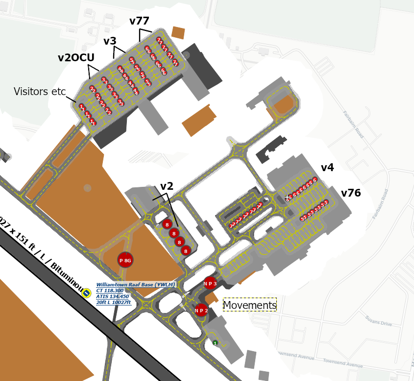

## YWLM Parking Diagram

## Important Frequencies
| Name               | Callsign       | Frequency        | 
| ------------------ | -------------- | ---------------- | 
| **Parent Sector** | **Brisbane Center**| **130.900** |
| **Williamtown Approach** | **Willy Approach**   | **133.300**     | 
| **Williamtown Tower (& CTAF)**    | **Willy Tower**  | **118.300**         |
| **Williamtown Ground**    | **Willy Ground**  | **121.800**         | 
| **Williamtown Delivery**    | **Willy Delivery**  | **130.350**         | 
| Williamtown ATIS    |   | 134.450         |

## Navaids
| Navaid               | Identifier       | Channel/Frequency| 
| ------------------ | -------------- | ---------------- | 
| **Tacan** | **WLM**   | **75X/112.8**     |
| **NDB** | **WLM** | **365 kHz** |
| **ILS RW12** | **IWM** | **42X/110.5** |

## CIRA Information
- Williamtown circuit area is within **5NM** WLM (`SFC`-`2500'`)
- Circuit Height: Jets - 1500', Props - 1000'
- Circuit Directions:
    - RWY 12 - Right
    - RWY 30 - Left
- Intial Points
    - RWY 12: The South-Western tip of Grahamstown Lake
    - RWY 30: The Coastline

## Departures
- Fast Jet departures to M550:
    - RWY 12:
        - RWY HDG (118°) TO COASTLINE, then turn left to H060°M to intercept 080° TAC WLM, then Enter M550 via Lane 4 at FL125 25DME WLM
    - RWY 30:
        - RWY HDG (298°) to 1DME, then turn left to intercept 080° TAC WLM, then enter M550 via Lane 4 at FL125 25 DME WLM
- Departures for other A/C:
    - Per published SID (via KEXAR, LIMLO, MONDO, UBSON or radar dep)
    - via Fast Jet procedures

## Arrivals